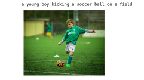

# Image Captioning

This project is based on the  [*Show, Attend, and Tell*](https://arxiv.org/abs/1502.03044) paper. It is based on using an Encoder-Decoder type of network to caption images. The encoder is a pretrained CNN (Resnet-101) while the Decoder LSTM architecture along with an Attention mechanism.

_________________

Image Captioning is the process of generating a textual description of an image. It uses both Natural Language Processing and Computer Vision to generate the captions.

<p align="center">
  
</p>

### **High-level Overview of Image Captioning**

**Network Architecture**

<p align="center">
  
</p>

**Encoder**

The Convolutional Neural Network(CNN) can be thought of as an encoder. The input image is given to CNN to extract the features. The last hidden state of the CNN is connected to the Decoder.


**The Decoder**

It is a RNN composed of Long-Short-Term-Memory Cells(LSTM's) which does language modeling up to the word level. The first time step receives the encoded output from the encoder and also the <START> vector. The encoder output is first passed through an attention network where it is analyzed for important pixels that the decoder needs to focus on at a given time step while decoding.

**Training**

The output from the last hidden state of the CNN(Encoder) is given to the first time step of the decoder. We set x1 =<START> vector and the desired label y1 = first word in the sequence. Analogously, we set xt =word vector of the first word and expect the network to predict the second word. Finally, on the last step, xt = last word, the target label yt =<END> token.
During training, the correct input is given to the decoder at every time-step, even if the decoder made a mistake before.

**Testing**

The attention weighted image representation is provided to the first time step of the decoder. Set x1 =<START> vector and compute the distribution over the first word y1. We sample a word from the distribution (or pick the argmax), set its embedding vector as x2, and repeat this process until the <END> token is generated.
During Testing, the output of the decoder at time t is fed back and becomes the input of the decoder at time setting the beam width too large would slow down performance and a beam-search of k=1 is equivalent to greedy approach t+1.


**Attention**

The use of Attention networks is widespread in deep learning, and with good reason. This is a way for a model to choose only those parts of the encoding that it thinks is relevant to the task at hand. The same mechanism you see employed here can be used in any model where the Encoder's output has multiple points in space or time. In image captioning, you consider some pixels more important than others. In sequence to sequence tasks like machine translation, you consider some words more important than others.

**Beam Search**

This is where we don't let our Decoder be lazy and simply choose the words with the best score at each decode-step. We avoid using the greedy approach because it's not necessary that the word with the highest probability at a time step would lead to a sentence with the best meaning or with highest probability. By setting a beam-size(k) of around (2-9) we expect the algorithm to keep track of at most k probable words that are in the running for a sentence with the highest score. Beam Search is useful for any language modeling problem because it finds the most optimal sequence. However, setting the beam width too large would slow down performance and a beam-search of k=1 is equivalent to a greedy approach.

## Pre-requisites
* You should understand how convolutional neural networks work. This also includes the understanding of transfer learning using the torchvision library.

* Basic NLP concepts such as Word-Embeddings.

* Understanding of Sequence Models along with LSTMs.

* Understanding of Attention for images.

* Other algorithms that you should be aware of is the Beam Search Technique.

* Intermediate knowledge of PyTorch. 


## Installation

Use the package manager [pip](https://pip.pypa.io/en/stable/)

```bash
pip install opencv-python
pip install numpy
pip install pandas
```
To install Pytorch follow: [Pytorch](https://pytorch.org/get-started/locally/) 

**Please note that the project is implemented and tested on Pytorch(1.5)** 


## Implementation

### 1. Datasets
* Common Objects in Context (COCO). A collection of more than 120 thousand images with descriptions: [Training](http://images.cocodataset.org/zips/train2014.zip), [Validation](http://images.cocodataset.org/zips/val2014.zip)
* Flickr 8K. A collection of 8 thousand described images taken from flickr.com.
* Flickr 30K. A collection of 30 thousand described images taken from flickr.com.
* [Exploring Image Captioning Datasets](http://sidgan.me/technical/2016/01/09/Exploring-Datasets), 2016

**You could also use [Andrej Karpathy's training, validation, and test splits](http://cs.stanford.edu/people/karpathy/deepimagesent/caption_datasets.zip). This zip file contains the captions. You will also find splits and captions for the Flicker8k and Flicker30k datasets, so feel free to use these instead of MSCOCO if the latter is too large for your computer.**


### 2. Project Files Structure
```
├── caption.py
├── create_input_files.py
├── data
│   └── dataset_flickr8k.json
├── data_output
├── datasets.py
├── evaluate.py
├── models.py
├── Script.ipynb
├── train.py
└── utils.py

```

0. ```Script.ipynb : ``` This is more like a test notebook which has some project execution guidelines. It has some examples to get along with some unusual lines of code in the project.

1. ```create_input_files.py : ``` This file is responsible for creating input files for training, validation, and test data. Now this file could take any of these data sets 'coco', 'flickr8k', 'flickr30k' along with the json files for that particular dataset. The JSON file contains captions along with info as to which caption is associated with which image. It stores the data along with its respective splits(train, test, validation),and the wordmaps(mapping captions to images) into the ```data_output``` folder.
**You need to run this file to prepare your data.**

2. ```datasets.py : ``` This file simply has the code to create a custom Pytorch Dataset that would later be used by the data generators.

3. ```models.py : ``` This is where you define your models (Encoder, Decoder, Attention mechanism). The Encoder is a pretrained Resnet101 on the 'ImageNet' dataset. The classification layers are detached as it is simply used for feature extraction. The Attention Network will provide a focused encoded image at every time step which would be given as input along with the word embedding of a caption to an LSTM cell. The Decoder comprises of LSTM's that finally map its output to a probability distribution of words from the vocabulary using a Fully connected layer.

4. ```train.py : ``` This is a driver file for simply training and validating the dataset. The final output would be a Trained Model Checkpoint which could later be used for predicting. If you don't have the resource capabilities for training on your own system you could also download the pre-trained weights for this model which was trained on the COCO dataset from [here](https://drive.google.com/open?id=189VY65I_n4RTpQnmLGj7IzVnOF6dmePC).

5. ```evaluate.py : ``` This file is simply for testing the model and getting a BLEU score for it.

6. ```caption.py : ``` This file is a complete pipeline between inputting an image to finally captioning it.


## Usage

```python caption.py --img='images/child_playing_soccer.jpg' --model='BEST_checkpoint_coco_5_cap_per_img_5_min_word_freq.pth.tar' --word_map='data_output/WORDMAP_coco_5_cap_per_img_5_min_word_freq.json' --beam_size=5```
<p align="center">
  
</p>

## Contributing
Pull requests are welcome. For major changes, please open an issue first to discuss what you would like to change.

## Acknowledgements

[Image Captioning in Deep Learning](https://towardsdatascience.com/image-captioning-in-deep-learning-9cd23fb4d8d2) by Pranoy Radhakrishnan

Sagar Vinodababu has an amazing tutorial on Image-captioning do check it out [here](https://github.com/sgrvinod/a-PyTorch-Tutorial-to-Image-Captioning)

[Beam Search](https://www.youtube.com/watch?v=RLWuzLLSIgw) Lecture by Andrew Ng 

[Attention Mechanism](https://www.youtube.com/watch?v=SysgYptB198) Lecture by Andrew Ng 
